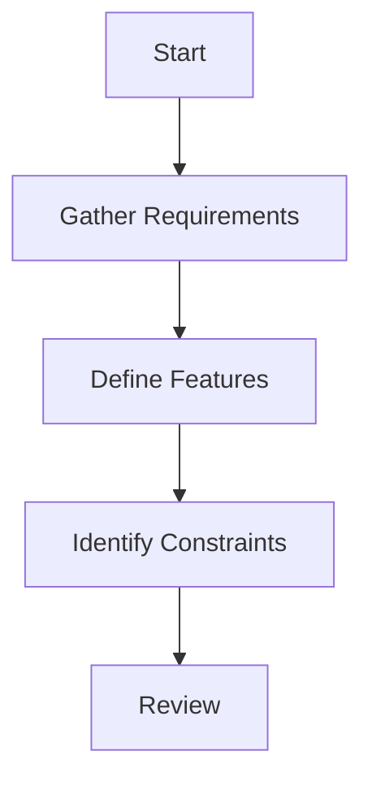

# 1. Requirements Gathering

## Project Goals

<!-- - List your main objectives here -->
- To develop a cross-platform desktop application for STEM students using Tauri, Next.js, and Spring Boot that tracks problem-solving performance and generates personalized practice sets targeting identified knowledge gaps.

## Features
<!-- - List key features here. -->
- User can press a keybind to quickly screenshot, then respond to problem solving performance in a minimal overlay UI to efficiently log their questions and performance.
- User can organize questions within subjects, subjects within courses, courses within folders to ensure that users can easily locate and categorize the questions they have visited.
- Users can enter a revision mode that feeds them previously visited questions of a particular scope (subject, course, folder) that they didn't perform well in.

## Constraints
<!-- - List any constraints here. -->
- Must be compatible for Win, Mac, Linux
- Must store data locally for regular accounts (offline-first approach)
- Requires internet connectivity for cloud sync on premium accounts
- Must allow users to upgrade from local to cloud storage without data loss
- Cannot include copyrighted educational content without explicit permission
- Must support global keyboard shortcuts across different operating systems
- Limited to English language interface for initial release

## Requirements Flowchart

