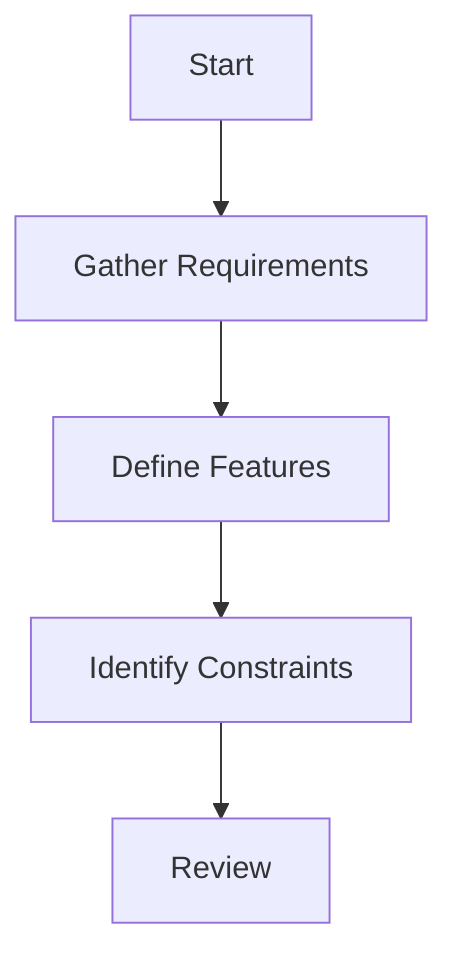

# 1. Requirements Gathering

## Project Goals
- List your main objectives here.

## Features
- List key features here.

## Constraints
- List any constraints here.

## Requirements Flowchart

```mermaid
flowchart TD
    A[Start] --> B[Gather Requirements]
    B --> C[Define Features]
    C --> D[Identify Constraints]
    D --> E[Review]
```
