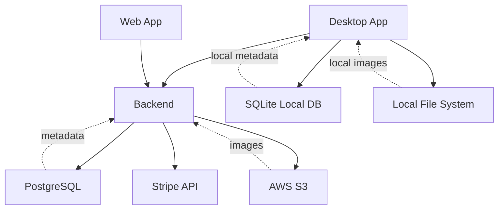

# 2. System Architecture Design

## Major Components
- Desktop App (Tauri + Next.js) - Screenshot capture + full features
- Web App (Next.js deployed) - Manual upload + full features
- Backend (Kotlin Spring Boot) - API and business logic
- Database (PostgreSQL) - Stores problem metadata, user data, and performance analytics
- Local Database (SQLite) - Stores local problem metadata and performance data
- Object Storage (AWS S3) - Stores problem images and screenshots
- Local File System - Stores local problem images and screenshots
- Payment Service (Stripe) - Handles premium subscriptions

## Architecture Diagram

