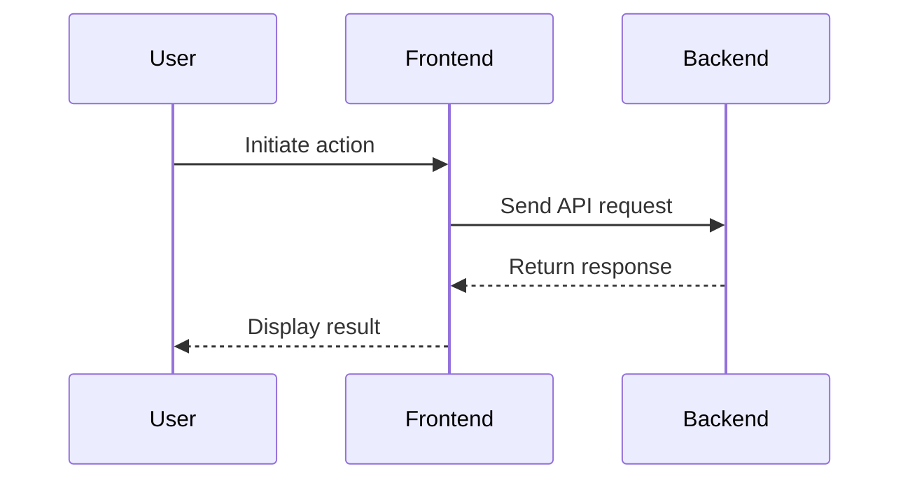

# 3. Interaction Modeling

## Component Interactions
- API calls
- User actions

## Sequence Diagram

```mermaid
sequenceDiagram
    participant User
    participant Frontend
    participant Backend
    User->>Frontend: Initiate action
    Frontend->>Backend: Send API request
    Backend-->>Frontend: Return response
    Frontend-->>User: Display result
```
