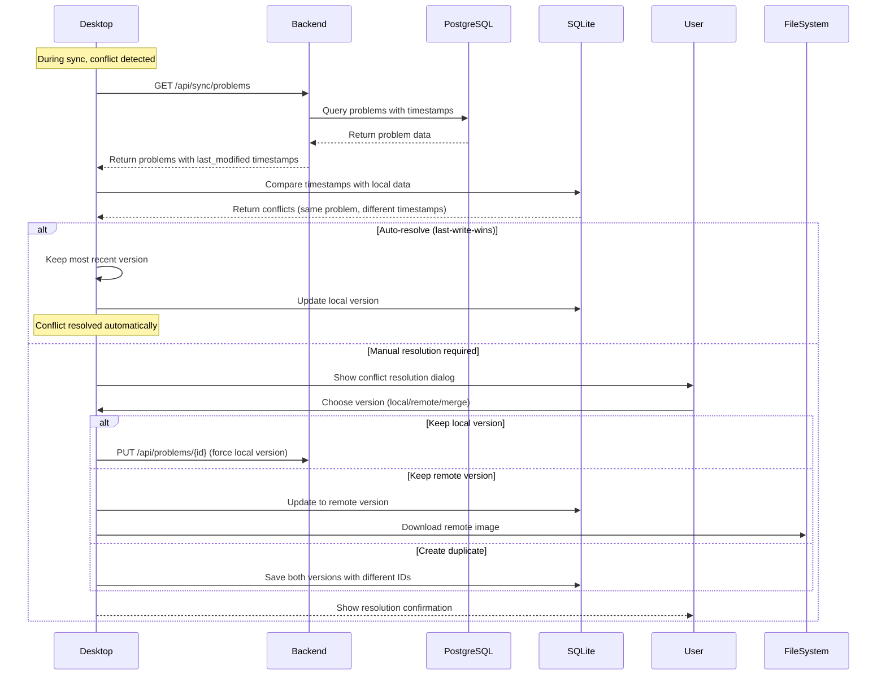

# 3. Interaction Modeling

## Component Interactions
- Screenshot capture and problem logging (Desktop only)
- Manual image upload and problem creation (Web and Desktop)
- Problem organization into hierarchical structure (Folders → Courses → Subjects)
- Performance tracking and analytics
- Cloud sync for premium users
- Revision mode with filtered problem sets

## Key User Flows

### 1. Problem Creation (Desktop - Screenshot)

### 2. Problem Creation (Web - Manual Upload)

### 3. Cloud Sync (Desktop - Premium Users)

### 4. Problem Retrieval and Display (Desktop)

### 5. Problem Retrieval and Display (Web - Smart Caching)

### 6. Revision Mode (Desktop)

### 7. Revision Mode (Web)

### 8. User Authentication (Login)

### 9. Problem Editing

### 10. Sync Conflict Resolution

