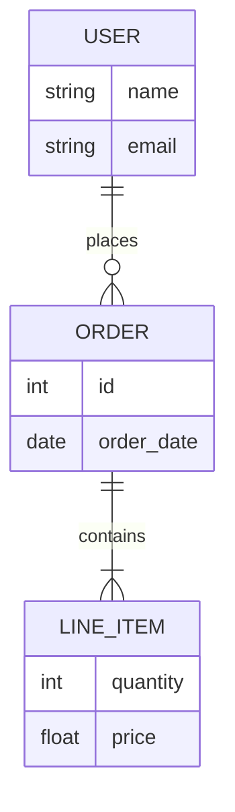

# 4. Data Modeling

## Entities & Relationships
- List entities and their attributes.

## ER Diagram

```mermaid
erDiagram
    USER ||--o{ ORDER : places
    ORDER ||--|{ LINE_ITEM : contains
    USER {
        string name
        string email
    }
    ORDER {
        int id
        date order_date
    }
    LINE_ITEM {
        int quantity
        float price
    }
```
