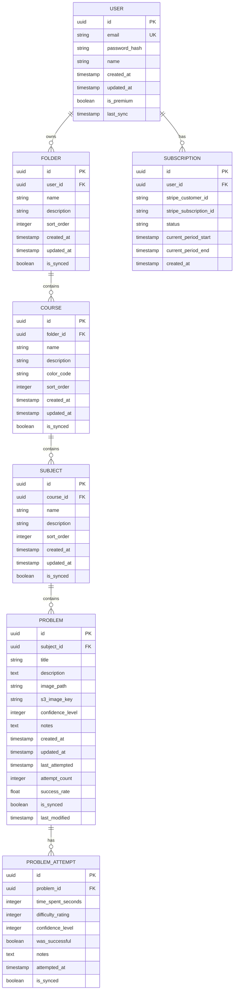

# 4. Data Modeling

## Entities & Relationships
- **Users**: Account information and subscription status
- **Folders**: Top-level organization (e.g., "Fall 2024", "Personal Study")
- **Courses**: Subject areas within folders (e.g., "Calculus I", "Physics 101")
- **Subjects**: Topics within courses (e.g., "Derivatives", "Kinematics")
- **Problems**: Individual problem instances with metadata and performance data
- **Problem Attempts**: Individual solve attempts with performance metrics
- **Subscriptions**: Premium subscription management via Stripe

## ER Diagram

