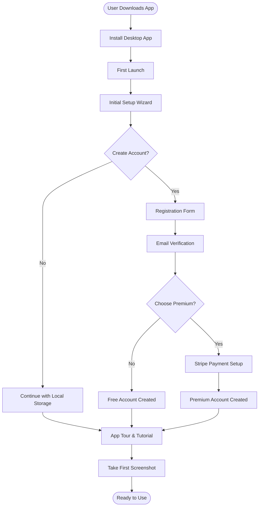
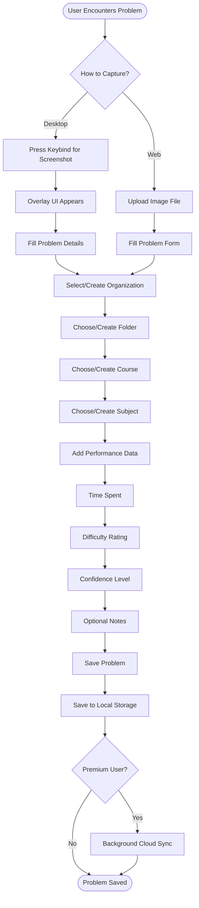
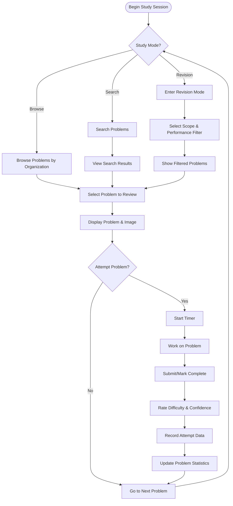
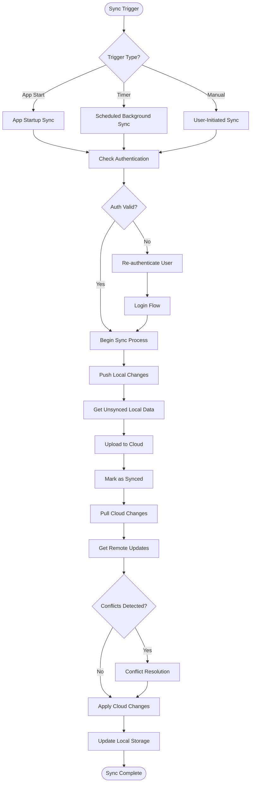
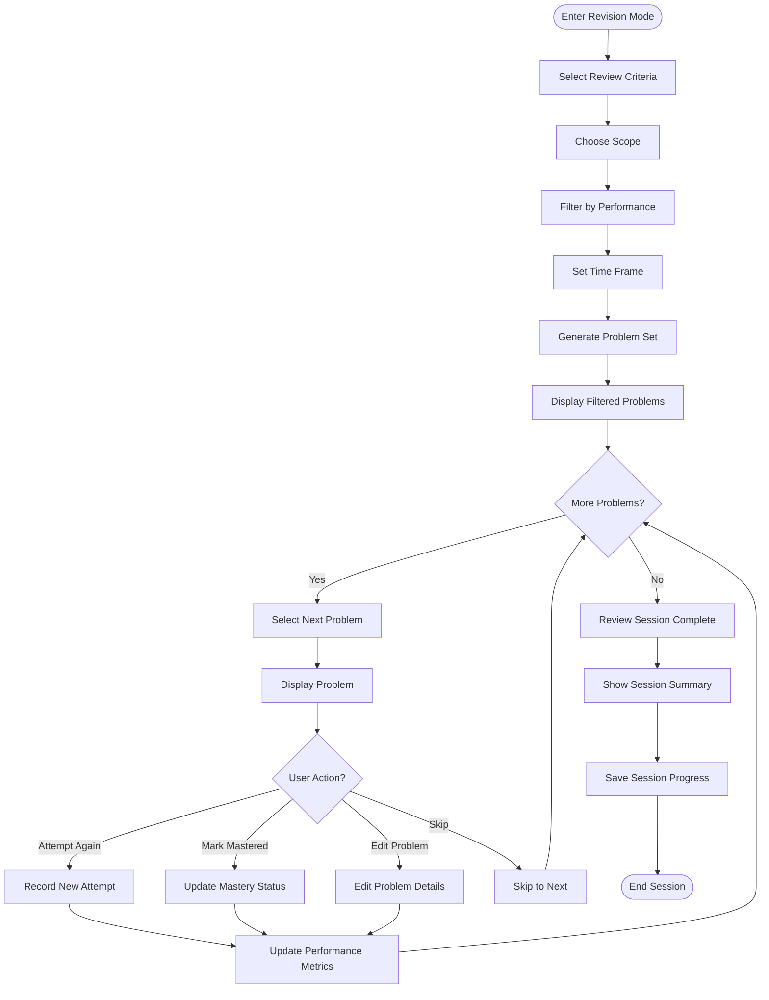

# 5. Process Mapping

## Key Workflows
- User onboarding and account setup
- Problem capture and organization workflow
- Study session and performance tracking
- Cloud synchronization for premium users
- Problem review and revision workflow

## User Onboarding Process

## Problem Capture and Organization Workflow

## Study Session and Performance Tracking

## Cloud Synchronization Process (Premium)

## Problem Review and Revision Workflow

